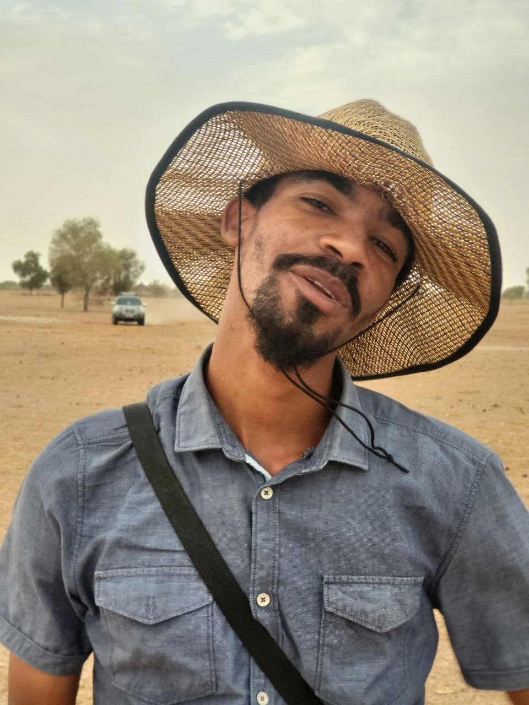

---
hide:
  - toc
  - navigation
---

## Xootay Gox Yi

> _**Xootay**_, En wolof, cela désigne la profondeur. Parce qu'un territoire mérite mieux qu'un regard superficiel. Il se lit dans ses sols, ses eaux, ses limites invisibles.

> _**Gox yi**_, ce sont les territoires: ces espaces que l'on arpente, que l'on survole, que l'on mesure.

Mais un territoire ne se réduit pas à ses coordonnées. Il y a ce que la carte montre, et ce qu'elle ne dit pas encore. La texture du sol sous le drone, l'eau qui chemine sous la forêt de mangrove, la parcelle d'un paysan qui attend d'être reconnue.
Ce site est une tentative modeste de saisir tout ça. Pas un portfolio parfait, mais un carnet de bord honnête : des projets, des outils, des erreurs, des apprentissages. Ce que je fais, comment je le fais, et pourquoi ça compte. Ici, au Sénégal, en Afrique de l'Ouest.
Tu y trouveras de la cartographie, du code, des réflexions de terrain. Et peut-être, entre les lignes, quelque chose sur ce que signifie aller au fond d'un territoire.

---

## Ce que vous trouverez ici

-   :material-map:{ .lg .middle } **Réalisations**

    ---

    Projets terrain, scripts géospatiaux, outils d'automatisation et applications. Du drone sur le terrain au code sur le serveur.

    [Voir les réalisations :material-arrow-right:](realisations/index.md){ .md-button }

-   :material-post:{ .lg .middle } **Blog**

    ---

    Tutoriels techniques (PyQGIS, Python, Metashape), retours d'expérience terrain et réflexions sur la géomatique en Afrique de l'Ouest.

    [Lire le blog :material-arrow-right:](blog/index.md){ .md-button }

-   :material-file-document:{ .lg .middle } **Publications**

    ---

    Mémoires académiques, rapports de recherche et productions écrites : des travaux sur l'hydrologie, la géomatique et l'environnement au Sénégal.

    [Voir les publications :material-arrow-right:](publications.md){ .md-button }

---
## Qui est derrière ce site

**Abdou Aziz Darc** — géographe, technicien supérieur en géomatique et télépilote, basé à Diamniadio, Dakar.

Mon quotidien se partage entre les vols de drones, la production cartographique, l'analyse spatiale et le développement de scripts d'automatisation. 
Qu'il s'agisse de manipuler QGIS, Python, Agisoft Metashape ou Google Earth Engine, la démarche reste la même : **explorer et apprendre en continu**. L'objectif de cet espace n'est pas de poser en expert absolu, mais de partager humblement mes retours d'expérience et mes apprentissages de terrain.

  

-   :material-quadcopter: **Drone & Photogrammétrie**

    DJI Mavic 3 · Phantom 4 Pro · Matrice 300 LIDAR · Metashape · Pix4D

-   :material-map: **SIG & Cartographie**

    QGIS · ArcGIS Pro · SAGA GIS · QField · PyQGIS

-   :material-satellite-variant: **Télédétection**

    ENVI · Google Earth Engine · ERDAS · Classifications · NDVI/NDRE

-   :material-code-braces: **Programmation**

    Python · GeoPandas · Rasterio · R · HTML/CSS

[En savoir plus sur moi ? :material-arrow-right:](contact.md){ .md-button }